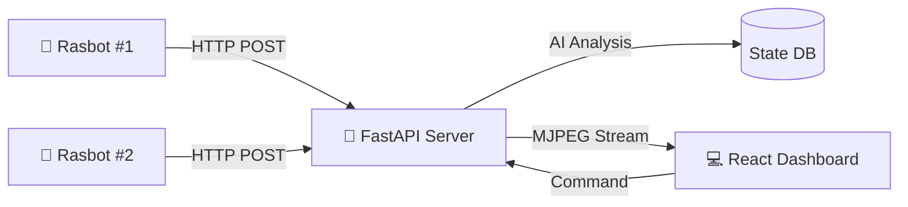

# 🛡️ ETRI Lab Guardian System
> AI 기반 다중 로봇 실험실 안전 관제 시스템 (AI-Powered Multi-Robot Laboratory Safety Monitoring System)

<div align="center">


</div>

---

## 📖 Project Overview

**Lab Guardian**은 위험한 실험실 환경을 자율 주행 로봇(Rasbot)이 순찰하며, AI(VLM)를 통해 위험 상황(사람 쓰러짐, 화재 등)을 실시간으로 감지하고 관제실에 알리는 웹 기반 통합 모니터링 시스템입니다.

### ✨ Key Features
* **Real-time Low Latency Streaming:** MJPEG 기반의 초저지연 영상 스트리밍 구현 (OpenCV + FastAPI).
* **Multi-Robot Control:** 2대 이상의 로봇을 동시에 관제 및 상태 모니터링.
* **AI Vision Analysis:** VLM(Vision Language Model)을 활용한 실시간 위험 상황 텍스트 브리핑.
* **Interactive Dashboard:** 직관적인 UI/UX, 다크 모드, 긴급 상황 시각적 알림 (MUI v6).
* **High Performance:** `requests.Session` 및 이미지 최적화를 통한 고속 데이터 전송 파이프라인.

---

## 📸 Dashboard Preview

<div align="center">
  
</div>

---

## 🏗️ System Architecture


---
## 🚀 Getting Started (통합 실행 가이드)
전체 시스템을 구동하기 위해서는 총 3개의 터미널(CMD)이 필요합니다. 루트 폴더에서 터미널 3개를 열고, 각 터미널에서 아래 명령어를 순서대로 실행해 주세요.

### 🖥️ Terminal 1: 웹 대시보드 (Frontend)
React 웹 애플리케이션을 실행합니다.

```bash
# 1. 웹 폴더로 이동
cd lab-guardian-web

# 2. 의존성 설치 (최초 1회)
npm install

# 3. 개발 서버 실행
npm run dev
```
### 🧠 Terminal 2: 관제 서버 (Backend)
FastAPI 서버를 실행하여 로봇의 신호를 받습니다.
```bash
# 1. 서버 폴더로 이동
cd lab-guardian-server

# 2. 가상환경 생성 (최초 1회)
python -m venv venv

# 3. 가상환경 활성화 (Windows)
.\venv\Scripts\activate

# 4. 필수 패키지 설치
pip install -r requirements.txt

# 5. 메인 서버 실행
python main.py
```
### 🤖 Terminal 3: 로봇 시뮬레이터 (Robot)
카메라(웹캠)를 통해 영상을 서버로 전송합니다.
```bash
# 1. 서버 폴더로 이동
cd lab-guardian-server

# 2. 가상환경 활성화 (Windows)
# (주의: 서버와 별개로 이 터미널에서도 가상환경을 켜야 합니다)
.\venv\Scripts\activate

# 3. 로봇 시뮬레이터 실행
python dummy_robot.py
```

---

## 📂 Project Structure
```bash
root/
├── lab-guardian-server/   # Backend (FastAPI)
│   ├── main.py            # API Server & Streaming Logic
│   ├── dummy_robot.py     # Robot Simulator (Client Logic)
│   ├── requirements.txt   # Python Dependency List
│   └── venv/              # Python Virtual Environment
│
└── lab-guardian-web/      # Frontend (React + Vite)
    ├── src/
    │   ├── App.tsx        # Dashboard UI & Logic
    │   └── main.tsx       # Entry Point
    └── package.json
```

---

## 🛠️ Troubleshooting

Q. 카메라가 켜지지 않고 멈춰있어요.

dummy_robot.py 파일에서 cv2.VideoCapture(0, cv2.CAP_DSHOW) 옵션을 추가하거나, 인덱스 번호를 1로 변경해 보세요.

Q. 영상이 너무 끊겨서 보여요.

HTTP 핸드셰이크 오버헤드 때문입니다. requests.Session()을 사용하여 세션을 유지하고 있는지 확인하세요. (현재 코드 적용 완료)

Q. MUI Grid 관련 오류가 떠요.

MUI v6부터는 <Grid item> 대신 <Grid size={{ xs: 12 }}> 형식을 사용해야 합니다. 또는 Grid2 컴포넌트를 사용하세요.

---
<div align="center"> <sub>Built with by 이민하 @ 자율형IoT연구실</sub> </div>
