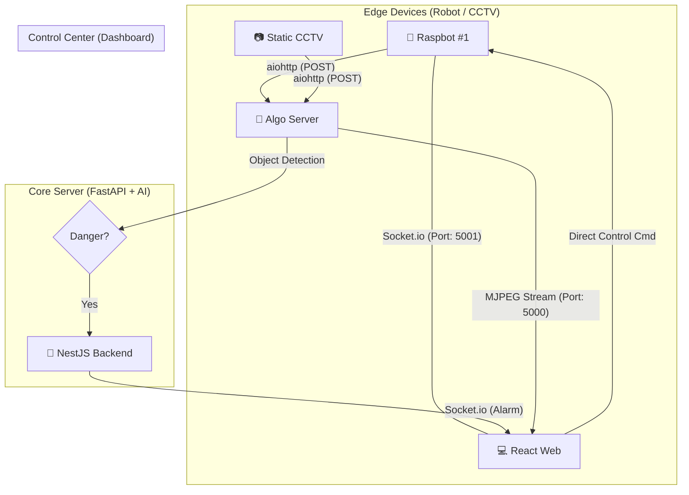
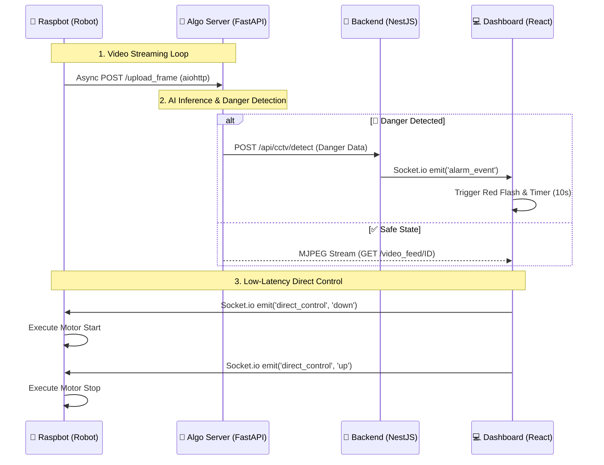

# 🛡️ ETRI Lab Guardian System
> **AI 기반 다중 로봇 실험실 안전 관제 시스템** > (AI-Powered Multi-Robot Laboratory Safety Monitoring System)

<div align="center">


</div>

---

## 📖 Project Overview
**Lab Guardian**은 위험한 실험실 환경을 순찰하는 자율 주행 로봇(Raspbot)과 고정형 CCTV를 통합 관리하는 시스템입니다. AI 객체 탐지를 통해 위험 상황을 실시간 감지하며, 긴급 상황 시 시각적 알람과 함께 즉각적인 관제가 가능하도록 설계되었습니다. 특히, **중간 서버를 거치지 않는 로봇 직결 제어 시스템**을 통해 초저지연 조종 성능을 확보했습니다.

### ✨ 핵심 업데이트 기능 (Core Features)
* **Smart Area Maximization:** 각 구역(CCTV/Robot) 내에서 영상 비율을 유지하며 영역을 꽉 채우는(`object-fit: cover`) 스마트 전체화면 기능.
* **Direct Web-to-Robot Control:** Socket.io를 활용해 웹 브라우저에서 로봇(Raspberry Pi)으로 제어 신호를 직접 송신하여 지연 시간(Latency) 최소화.
* **Auto-Recovery Alarm:** 위험 감지 시 붉은색 점멸 알람이 발생하며, **10초 후 자동으로 정상 상태로 복구**되는 지능형 타이머 로직.
* **Hold-to-Move Logic:** 키보드를 누르고 있는 동안만 이동하고, 떼는 즉시 멈추는 **'실시간 상태 기반 제어'** 구현.
* **Asynchronous Data Pipeline:** `aiohttp` 기반의 비동기 이미지 전송을 통해 로봇 제어와 영상 송출 간의 간섭 현상을 완벽히 해결.

---

## 🏗️ System Architecture

### 1. High-Level Architecture


### 2. Data Flow Sequence (상세 데이터 흐름)


---

## 💡 Technical Decisions (기술적 의사결정)
### 1. 웹-로봇 직접 제어 (Web-to-Robot Direct Control)
중간 서버를 거치는 일반적인 명령 체계는 네트워크 홉(Hop) 증가로 인해 조종 지연을 유발합니다. 본 프로젝트는 로봇 내부에 **별도의 경량 Socket.io 서버(Port 5001)**를 구축하여 브라우저에서 로봇으로 명령을 직송함으로써, 실험실 환경에서의 즉각적인 사고 대응이 가능하도록 했습니다.


### 2. aiohttp 기반의 비동기 데이터 파이프라인
기존 requests 라이브러리의 동기 전송 방식은 영상 프레임을 보낼 때마다 로봇의 제어 루프를 차단(Block)하여 주행이 끊기는 문제를 발생시켰습니다. 이를 해결하기 위해 aiohttp와 asyncio를 도입하여 영상 전송과 로봇 제어를 병렬 처리함으로써, 매끄러운 주행과 고화질 스트리밍을 동시에 달성했습니다.


### 3. 상태 기반 실시간 제어 및 타이머 로직
+ Control: 키보드 중복 입력을 방지하기 위한 pressedKeys Set 관리와 KeyDown/Up 이벤트의 명확한 분리를 통해 부드러운 핸들링 구현.

+ Alarm: useRef를 활용해 알람 복구 타이머 ID를 관리함으로써, 리렌더링 시에도 정확한 복구 시점을 유지하고 불필요한 알람 중복을 제어(Debouncing).

---

## 🚀 Getting Started (통합 실행 가이드)
### 1️⃣ 알고리즘 및 관제 서버 (PC)
```bash
# 알고리즘 서버 실행 (FastAPI)
cd lab-guardian-server
# 필요 라이브러리: fastapi, uvicorn, opencv-python, requests
python main.py
```
### 2️⃣ 웹 대시보드 (React)
```bash
# 의존성 설치 및 실행
cd lab-guardian-web
npm install
npm run dev
```
### 3️⃣ 로봇 실기체 (Raspberry Pi)
```bash
# 방화벽 개방 (5001 포트 허용 필수)
sudo ufw allow 5001/tcp

# 로봇 메인 제어 서버 실행
cd lab-guardian-robot
python main_server.py
```

---

## 📂 Project Structure
```bash
root/
├── lab-guardian-server/     # 알고리즘 서버 (FastAPI)
│   ├── main.py              # AI 탐지 및 MJPEG 스트리밍 (Port 5000)
│   ├── ai_detector.py       # YOLO 기반 객체 탐지 및 추적
│   └── config.py            # 서버 네트워크 설정
│
├── lab-guardian-web/        # 관제 대시보드 (React)
│   ├── src/
│   │   ├── App.tsx          # 10초 복구 타이머 및 로봇 직결 제어 로직
│   │   └── common/config.ts # API 서버 주소 관리
│
└── lab-guardian-robot/      # 로봇 클라이언트 (Raspberry Pi)
    ├── main_server.py       # 비동기 영상 전송 및 5001 제어 소켓 서버
    ├── control.py           # 로컬/웹 통합 로봇 제어 엔진
    └── Raspbot_Lib.py       # I2C 하드웨어 제어 라이브러리
```

---

## 🛠️ Troubleshooting (심화 해결 사례)
### Q. 웹 로그는 찍히는데 로봇이 움직이지 않습니다.
해결: 라즈베리파이의 5001번 포트가 방화벽에 막혀있는지 확인하세요 (sudo ufw status). 또한, App.tsx의 ROBOT_DIRECT_URL이 실제 로봇의 IP와 일치해야 합니다.

### Q. 로봇 주행 중 영상이 멈추거나 딜레이가 심합니다.
해결: main_server.py에서 영상 전송 루프의 asyncio.sleep() 값을 조정하거나, 알고리즘 서버의 처리 속도를 체크하세요. 비동기 aiohttp 전송이 정상 동작하는지 로그를 확인해야 합니다.

---

<div align="center"> <b>This project was designed and developed entirely by GyuBeom Hwang.</b>


<sub>1인 개인 프로젝트 | ETRI 자율형IoT연구실</sub> </div>
