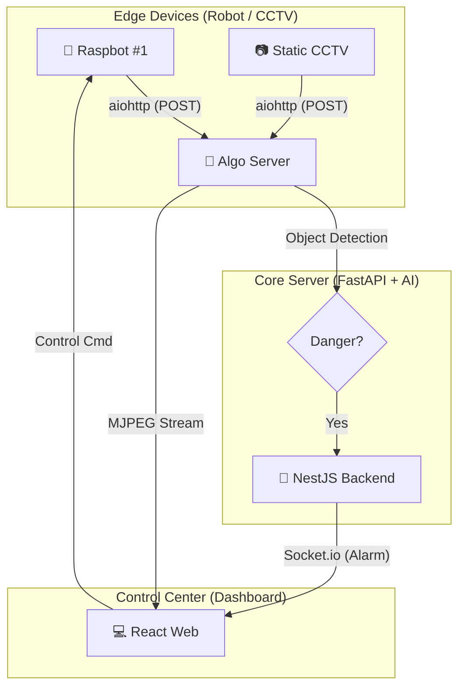
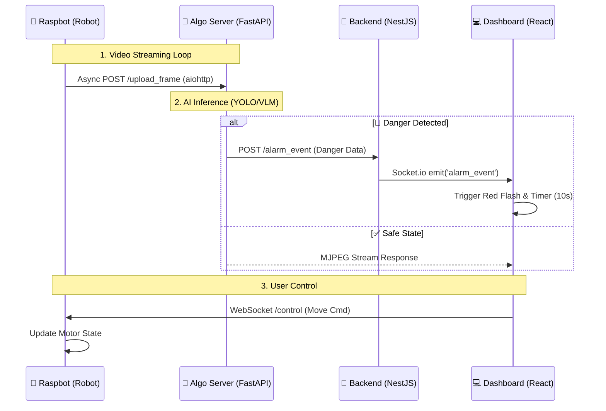

# 🛡️ ETRI Lab Guardian System
> **AI 기반 다중 로봇 실험실 안전 관제 시스템**
> (AI-Powered Multi-Robot Laboratory Safety Monitoring System)

<div align="center">


</div>

---

## 📖 Project Overview
**Lab Guardian**은 위험한 실험실 환경을 순찰하는 자율 주행 로봇(Raspbot)과 고정형 CCTV를 통합 관리하는 시스템입니다. AI 객체 탐지를 통해 위험 상황을 실시간 감지하며, 긴급 상황 시 시각적 알람과 함께 즉각적인 관제가 가능하도록 설계되었습니다.

### ✨ 핵심 업데이트 기능 (Core Features)
* **Smart Area Maximization:** 각 구역(CCTV/Robot) 내에서 영상 비율을 유지하며 영역을 꽉 채우는(`object-fit: cover`) 스마트 전체화면 기능.
* **Auto-Recovery Alarm:** 위험 감지 시 붉은색 점멸 알람이 발생하며, **10초 후 자동으로 정상 상태로 복구**되는 지능형 타이머 로직.
* **Asynchronous Data Pipeline:** `aiohttp` 기반의 비동기 이미지 전송을 통해 로봇 제어 지연(Latency) 문제를 완벽히 해결.
* **Split-View Architecture:** CCTV(좌)와 로봇(우) 구역을 분리하여 다수의 장치를 체계적으로 관리.
* **Low-Latency Streaming:** OpenCV와 FastAPI를 결합한 MJPEG 스트리밍으로 웹 대시보드에 초저지연 영상 송출.

---

## 🏗️ System Architecture

### 1. High-Level Architecture


### 2. Data Flow Sequence (상세 데이터 흐름)
로봇의 영상 전송부터 AI 분석, 웹 대시보드 알람, 그리고 사용자 제어까지의 흐름입니다.


---

## 💡 Technical Decisions (기술적 의사결정)
### 1. aiohttp 기반의 비동기 데이터 파이프라인
기존 requests 라이브러리의 동기(Synchronous) 전송 방식은 영상 프레임을 보낼 때마다 로봇의 모터 제어 루프를 차단(Block)하여 주행이 끊기는 문제를 발생시켰습니다. 이를 해결하기 위해 aiohttp와 asyncio를 도입하여 영상 전송과 로봇 제어를 비동기로 병렬 처리함으로써, 매끄러운 주행과 고화질 스트리밍을 동시에 달성했습니다.

### 2. Object-fit: Cover를 활용한 몰입형 UX
일반적인 관제 시스템은 원본 비율 유지를 위해 검은 여백(Letterbox)을 허용하지만, 본 프로젝트는 직관적인 모니터링을 위해 object-fit: cover 속성을 채택했습니다. 이를 통해 다양한 디바이스 화면 크기에서도 빈 공간 없이 영상을 꽉 채워 보여주며, 중요 객체가 잘리지 않도록 Flexbox 기반의 중앙 정렬 알고리즘을 구현했습니다.

### 3. Stateful Timer Logic for Alarm Recovery
단순한 알람 표시를 넘어, 실제 관제 상황을 고려하여 **'10초 자동 복구 로직'**을 설계했습니다. useRef를 활용해 타이머 ID를 고유하게 관리함으로써, 리렌더링 시에도 타이머가 초기화되지 않고 정확한 시간을 유지하며 중복 알람 시 타이머를 리셋(Debouncing)하여 시스템 안정성을 높였습니다.

---

## 🚀 Getting Started (통합 실행 가이드)
### 1️⃣ 알고리즘 및 관제 서버 (PC)
```bash
cd lab-guardian-server
# 필수 라이브러리: fastapi, uvicorn, opencv-python, numpy
python main.py
```

### 2️⃣ 웹 대시보드 (React)
```bash
cd lab-guardian-web
npm install
npm run dev
```

### 3️⃣ 로봇 실기체 (Raspberry Pi)
```bash
# 필수 라이브러리 설치
pip install aiohttp websockets opencv-python smbus2
python main_robot.py
```

---

## 📂 Project Structure
```bash
root/
├── lab-guardian-server/     # 알고리즘 서버 (FastAPI)
│   ├── main.py              # AI 탐지 및 스트리밍 엔진 (access_log 차단 적용)
│   ├── ai_detector.py       # YOLO/VLM 기반 객체 탐지 로직
│   └── config.py            # IP 및 포트 설정
│
├── lab-guardian-web/        # 관제 대시보드 (React)
│   ├── src/
│   │   ├── App.tsx          # 영역별 전체화면 및 10초 복구 타이머 로직
│   │   └── common/config.ts # 네트워크 연결 설정
│
└── lab-guardian-robot/      # 로봇 클라이언트 (Raspberry Pi)
    ├── main_robot.py        # 비동기 영상 전송 및 제어 통합 코드
    └── Raspbot_Lib.py       # 하드웨어 제어 라이브러리
```

---

## 🛠️ Troubleshooting (심화 해결 사례)
### Q. 영상이 'No Signal'이거나 무한 로딩됩니다.
원인: PC 방화벽이 3000번 포트를 차단했거나, 로봇에 라이브러리가 없습니다.

해결: PC의 윈도우 방화벽 설정을 해제하고, 로봇에서 pip install aiohttp 설치 여부를 확인하세요.

### Q. 로봇 제어(움직임)는 되는데 영상이 멈춰있습니다.
원인: 카메라 리소스가 다른 프로세스에 의해 잠겨있을 수 있습니다.

해결: 로봇 터미널에서 sudo fuser -k /dev/video0를 입력해 카메라 프로세스를 초기화하세요.

### Q. 전체화면 시 영상이 좌측으로 쏠립니다.
원인: Grid 시스템의 기본 정렬이 Flex-start이기 때문입니다.

해결: Grid Container에 justifyContent="center"와 alignItems="center" 속성을 적용하여 강제 중앙 정렬을 수행했습니다. (최신 코드 반영됨)

### Q. 장치를 추가했는데 로그가 찍히지 않아요.
해결: 로봇 코드(config.py 또는 main_robot.py)에 설정된 ID(예: 1)와 웹 대시보드에서 등록한 ID가 정확히 일치해야 합니다.

<div align="center"> <b>This project was designed and developed entirely by GyuBeom Hwang.</b>


<sub>1인 개인 프로젝트 | ETRI 자율형IoT연구실</sub> </div>
