# 🛡️ ETRI Lab Guardian System
> **AI 기반 다중 로봇 및 CCTV 통합 실험실 안전 관제 시스템**
> <br/>(AI-Powered Multi-Robot & CCTV Laboratory Safety Monitoring System)

<div align="center">


<br/> 

</div>

---

## 📖 Project Overview
**Lab Guardian**은 위험한 실험실 환경을 순찰하는 자율 주행 로봇(Raspbot)과 고정형 CCTV를 통합 관리하는 시스템입니다. AI 객체 탐지를 통해 위험 상황을 실시간 감지하며, **전용 C# 게이트웨이**를 통해 모든 보안 이벤트를 데이터베이스에 체계적으로 기록합니다.

특히, 최신 업데이트를 통해 **자동 증거 확보(스냅샷/녹화)** 및 **텔레그램 실시간 알림** 기능을 탑재하여 관제 효율을 극대화했습니다. 또한 연산(탐지/추적)은 **Python 알고리즘 서버**, I/O(로그 저장)는 **C# 게이트웨이**로 역할을 분리해 병목을 완화했습니다.

### ✨ 핵심 업데이트 기능 (New Features)
* **📸 Smart Evidence Recording:** 위험 감지 시 **즉시 스냅샷**을 촬영하고 **10초간 영상을 녹화**하여 로컬 스토리지에 자동 저장.
* **🖼️ Static Image Server:** FastAPI의 `StaticFiles`를 활용해 저장된 증거 자료를 웹 브라우저에서 URL 링크로 즉시 확인 가능한 이미지 서버 구축.
* **📱 Real-time Telegram Alert:** 침입자 감지 시 보안 담당자의 텔레그램으로 현장 사진과 경고 메시지를 즉시 전송 (방화벽 우회 처리 적용).
* **📂 Modular Architecture:** `main.py`의 비대화를 막기 위해 `functions/` 폴더(AI, 녹화, 알림, DB)로 핵심 로직을 분리하여 유지보수성 강화.
* **Integrated C# Gateway:** 엣지 장치에서 전송된 `이미지 경로(Path)` 데이터를 파싱하여 SQLite DB에 메타데이터로 저장하는 고성능 허브.
* **Compute/I-O 분리 설계:** 연산 집약적 AI 처리는 Python, I/O 중심 로그 저장은 C# 게이트웨이에서 수행하도록 분리.
* **Dual-Column Log System:** CCTV와 로봇 로그를 분리 저장하며, 스냅샷이 포함된 로그는 웹 대시보드에서 `[📸]` 아이콘으로 표시.
* **Auto-Recovery Alarm:** 위험 감지 시 붉은색 점멸 알람이 발생하며, 일정 쿨타임 후 자동으로 정상 상태로 복구되는 지능형 로직.

---

## 🏗️ System Architecture

### 1. High-Level Architecture

```mermaid
graph TD
    subgraph "Edge Devices & AI Core"
        A["🤖 Raspbot"] -- "Video Stream" --> C
        B["📷 RealSense/CCTV"] -- "Video Stream" --> C
        C["🧠 Algo Server (FastAPI)"]
        C -- "Save MP4/JPG" --> S["📂 Local Storage (recordings/)"]
        C -- "Send Photo" --> T["📱 Telegram Bot"]
    end

    subgraph "Data & Control Hub"
        C -- "TCP (Log + Image Path)" --> G["🚀 C# Gateway"]
        G -- "Insert Metadata" --> DB[("SQLite DB")]
        G -- "WebSocket (JSON)" --> F
    end

    subgraph "Control Center"
        F["💻 React Web"] -- "View Stream" --> C
        F -- "Fetch Image" --> S
        F -- "Direct Control" --> A
    end
```



---

## 2. Standardized Event Flow (이벤트 흐름)
모든 이벤트는 일관된 메시지 포맷으로 처리되어 DB와 웹에 동일하게 기록됩니다.

| **상태 \(Status\)** | **내용 \(Message\)** | **비고**             |
|-------------------|--------------------|--------------------|
| DANGER            | 🚨 침입자 감지! (📸 스냅샷)        | 이미지 경로 포함, 즉시 텔레그램 전송 및 녹화 시작 |
| SAFE              | ✅ 이상 없음 \(정기 보고\)  | 10분 주기 하트비트 보고     |
| CONNECTED         | 🌐 장치 연결 성공        | 장치 최초 접속 시 기록      |
| DISCONNECTED      | ❌ 장치 연결 끊김         | 5초 이상 신호 부재 시 기록   |
| CONTROL           | 🎮 조종 모드 진입        | 전체화면 조종 시 기록       |
| MONITOR           | 🛡️ 감시 모드 복귀       | 전체화면 해제 시 기록       |

---

## 💡 Technical Decisions (기술적 의사결정)

### 1. 하이브리드 저장 전략 (Hybrid Storage Strategy)
> **"Why store paths, not blobs?"**

이미지 파일(Binary) 자체를 DB에 저장할 경우 데이터베이스 용량이 급증하여 조회 속도가 저하됩니다. 이를 방지하기 위해 **대용량 미디어 파일은 로컬 디스크(`recordings/`)에 저장**하고, **SQLite DB에는 해당 파일의 경로(`SnapshotPath`)만 텍스트로 저장**하는 효율적인 구조를 채택했습니다.

### 2. 기능과 실행의 분리 (Separation of Concerns)
초기 단일 파일(`main.py`)로 구성된 서버 코드를 유지보수성을 위해 기능별로 모듈화했습니다.
* `functions/ai_detector.py`: YOLOv8 객체 탐지 및 추적
* `functions/recorder.py`: 스레드 기반 비동기 영상 녹화 및 스냅샷 관리
* `functions/notifier.py`: 텔레그램 API 연동 및 예외 처리
* `main.py`: FastAPI 라우팅 및 전체 프로세스 오케스트레이션

### 3. C# 기반 통합 게이트웨이
데이터 무결성을 위해 멀티스레딩에 강한 C#으로 게이트웨이를 구축했습니다. Python에서 TCP로 전송한 `ID:메시지:이미지경로` 형태의 패킷을 파싱하여, 경로가 존재할 경우에만 DB의 `SnapshotPath` 컬럼에 기록하도록 설계되었습니다.

---

## 📂 Project Structure (Updated)

```bash
root/
├── lab-guardian-gateway/    # C# 통합 게이트웨이
│   ├── Program.cs           # TCP 패킷 파싱 및 DB 저장 로직
│   └── LogDatabase.db       # SQLite (SnapshotPath 컬럼 포함)
│
├── lab-guardian-algorithm/  # AI 처리 및 미디어 서버
│   ├── main.py              # FastAPI 서버 진입점
│   ├── recordings/          # 📸 스냅샷 및 녹화 영상 저장소 (자동 생성)
│   └── functions/           # 🧩 핵심 기능 모듈화
│       ├── ai_detector.py   # YOLO & CentroidTracker
│       ├── recorder.py      # 영상 저장 및 경로 반환 로직
│       ├── notifier.py      # 텔레그램 봇 알림
│       └── centroidtracker.py
│
└── lab-guardian-web/        # React 관제 대시보드
    └── src/App.tsx          # 로그 내 이미지 아이콘 렌더링 지원
```

---

## 🚀 Getting Started

### 1️⃣ C# 게이트웨이 (Hub)
```bash
cd lab-guardian-gateway
# DB 스키마가 변경되었으므로 기존 .db 파일 삭제 후 실행 권장
dotnet run
```
Gateway HTTP API: http://{PC_IP}:8081 (health, logs, queues, dlq)


### 2️⃣ 알고리즘 서버 (AI Server)
```bash
cd lab-guardian-algorithm
# 필수 라이브러리 설치 (ultralytics, opencv, etc.)
pip install -r requirements.txt
# 서버 실행
python main.py
```

### 3️⃣ 웹 대시보드 (React)
```bash
cd lab-guardian-web
npm install
npm run dev
```

### 4️⃣ 로봇 시스템 (Raspberry Pi 환경)
로봇 가동을 위해 `lab-guardian-robot` 폴더를 라즈베리파이로 이동시킨 후 다음 과정을 진행합니다.
```bash
cd lab-guardian-robot
# 1. 가상환경 활성화
source venv-raspbot/bin/activate
# 2. 필수 라이브러리 설치
python raspbot_setup/py_install/setup.py
# 3. 로봇 메인 서버 실행
python main_server.py
```

---


## Runtime Checklist (2026-01-22)

Required local services
- Redis: 127.0.0.1:6379
- Gateway (C#): WS 8080, TCP 8888, HTTP 8081
- Algo (FastAPI): 3000
- Backend (Nest): 8000
- Web (Vite): 5173

Algorithm .env (required)
- File: lab-guardian-algorithm/.env
- Required keys: TELEGRAM_TOKEN, TELEGRAM_CHAT_ID, PC_IP
  - Example (replace with real token/chat id):
    TELEGRAM_TOKEN=YOUR_TOKEN
    TELEGRAM_CHAT_ID=YOUR_CHAT_ID
    PC_IP=192.168.0.149

Algorithm performance tuning (optional)
- STREAM_FPS (default 10): MJPEG 전송 FPS 제한
- DETECT_FPS (default 3): YOLO 추론 FPS 제한
- STREAM_WIDTH / STREAM_HEIGHT (default 640x360): 전송 프레임 해상도

Gateway HTTP API (Minimal)
- GET http://localhost:8081/health
- GET http://localhost:8081/api/logs/recent?take=50&type=all|cctv|robot
- GET http://localhost:8081/api/queues
- GET http://localhost:8081/api/dlq
- POST http://localhost:8081/api/dlq/replay

Backend DLQ API (Nest)
- GET http://localhost:8000/admin/dlq
- POST http://localhost:8000/admin/dlq/replay

Quick smoke tests
- curl http://localhost:8081/health
- curl "http://localhost:8081/api/logs/recent?take=10&type=all"
- curl http://localhost:8000/admin/dlq

## 🛠️ Troubleshooting (해결 사례)

### 1. Hardware & Network (하드웨어 및 네트워크)
+ **RealSense `ERR_INCOMPLETE_CHUNKED_ENCODING` 및 연결 끊김**
    + **현상:** 웹캠은 정상 작동하나, RealSense 카메라 연결 시 스트리밍이 즉시 중단되거나 브라우저 콘솔에 인코딩 에러 발생.
    + **원인:** USB 2.0 포트의 전력 부족 및 640x480 해상도의 높은 대역폭으로 인한 데이터 병목 현상.
    + **해결:** 해상도를 **320x240으로 최적화**하여 대역폭을 확보하고, **USB 3.0 포트 연결**을 강제하여 하드웨어 안정성을 확보했습니다.

### 2. Backend Logic (백엔드 로직)
+ **이중 로그 발생 및 이미지 경로 누락 (NULL)**
    + **현상:** 위험 감지 시 로그가 2번 전송되며, 정작 중요한 스냅샷 로그에는 이미지 경로가 `NULL`로 기록되는 현상.
    + **원인:** '상태 변경(SAFE→DANGER)' 로직과 '알림 전송' 로직이 분리되어 있어 발생한 경쟁 조건(Race Condition).
    + **해결:** `main.py`의 로직을 통합하여, 위험 감지 시 **이미지 경로 생성 후 단일 패킷**으로 게이트웨이에 전송하도록 구조를 개선했습니다.

+ **모듈 리팩토링에 따른 `ModuleNotFoundError`**
    + **현상:** `main.py`의 비대화를 막기 위해 `functions/` 폴더로 파일을 분리한 후 `centroidtracker`를 찾지 못하는 에러 발생.
    + **해결:** Python의 실행 컨텍스트(Project Root)를 고려하여 `from functions.centroidtracker import ...`로 절대 경로 임포트 방식을 적용해 의존성 문제를 해결했습니다.

+ **FastAPI 정적 파일(Image) 404 에러**
    + **현상:** 이미지는 서버에 저장되었으나 웹에서 엑스박스(Not Found)가 뜨는 문제.
    + **해결:** FastAPI의 `StaticFiles`를 사용하여 `/recordings` 디렉토리를 마운트하고, DB 저장 시 로컬 경로가 아닌 **웹 접근 가능한 URL 경로**를 반환하도록 `recorder.py`를 수정했습니다.

### 3. System & Environment (시스템 및 환경)
+ **WinError 10054 (ConnectionResetError) 핸들링**
    + **현상:** 윈도우 환경에서 `asyncio` 이벤트 루프 종료 시 이미 닫힌 소켓에 접근하여 대량의 예외 로그 발생.
    + **해결:** `uvicorn` 실행 시 `_ProactorBasePipeTransport`의 연결 소실 콜백을 래핑(Wrapping)하여 불필요한 종료 로그를 무시하도록 패치했습니다.

+ **DB 파일 잠금(Locking) 방지**
    + **해결:** C# 게이트웨이와 Python 서버 간의 DB 접근 충돌을 방지하기 위해, 게이트웨이(C#)가 DB 쓰기 권한을 전담하고 Python은 TCP 메시지만 전송하는 **단방향 아키텍처**를 수립했습니다.

DLQ 확인 및 수동 복구: GET /admin/dlq, POST /admin/dlq/replay
???? ??? ?? ??: GET http://{PC_IP}:8081/api/logs/recent (??: /api/queues, /api/dlq)

### 4. Performance & CPU (??/CPU)
+ **??? 2? ???? CPU 30~45% ??**
    + **??:** RTSP ??? + MJPEG ???? CPU?? ???. YOLO? GPU? ???? I/O? CPU? ??.
    + **??:** ?? ???? ?? (???)
        1) `STREAM_FPS` ??? (10 ? 5)
        2) `STREAM_WIDTH/HEIGHT` ??? (640x360 ? 480x270)
        3) `DETECT_FPS` ??? (3 ? 2)
    + **?? ?(2? ??):**
        - STREAM_FPS=8
        - DETECT_FPS=2
        - STREAM_WIDTH=640
        - STREAM_HEIGHT=360

---

<div align="center"> <b>This project was designed and developed entirely by GyuBeom Hwang.</b>

<sub>1인 개인 프로젝트 | ETRI 자율형IoT연구실</sub>

</div>
